# Architecture and ER Diagrams

## Request architecture

```mermaid
flowchart LR
    Browser[Browser] --> Client[ASP.NET Core MVC client]
    Client -->|HttpClient + optional x-apikey| Apigee[Google Apigee proxy]
    Apigee -->|Verify API Key| API[ASP.NET Core REST API]
    API --> Controllers[Books, Members, Loans controllers]
    Controllers --> Mapping[DTOs + AutoMapper]
    Mapping --> Repository[Generic repository]
    Repository --> EF[Entity Framework Core]
    EF --> SQL[(SQL Server)]
```



For local development, the client can call the API directly with no key. In the published path, the same client changes only its base URL and API-key settings.

## Entity model

```mermaid
erDiagram
    BOOK ||--o{ LOAN : "BookId logical reference"
    MEMBER ||--o{ LOAN : "MemberId logical reference"

    BOOK {
        int Id PK
        string Title
        string Author
        string Category
        bool isAvailable
    }

    MEMBER {
        int Id PK
        string FullName
        string Email
        string PhoneNumber
    }

    LOAN {
        int Id PK
        int BookId
        int MemberId
        datetime BorrowDate
        datetime ReturnDate nullable
        string Status
    }
```

The links reflect the intended domain relationship. The current migration creates `BookId` and `MemberId` columns but does not enforce database foreign-key constraints, so the diagram must not be presented as proof of referential integrity.
